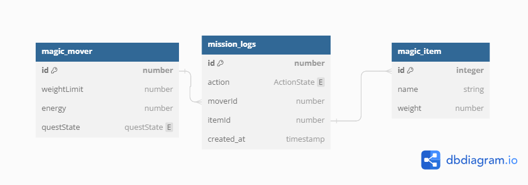
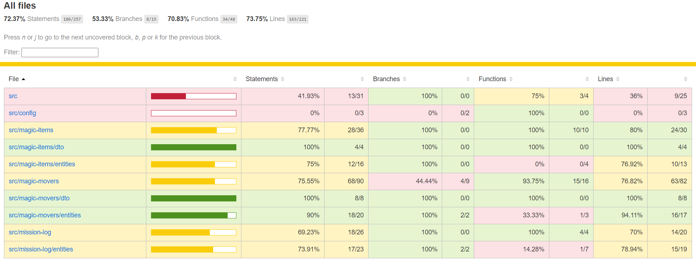

  <h1>Magic Transporters</h1>

  
Welcome to Magic Transporters, a Node.js application built with NestJS for managing magical transporters and items. This repository contains the backend API service.

   <h2>Database Diagram</h2>
  

    
  

  <h2>Table of Contents</h2>

  <ul>
    <li><a href="#introduction">Introduction</a></li>
    <li><a href="#features">Features</a></li>
    <li><a href="#description">Description</a></li>
    <li><a href="#prerequisites">Prerequisites</a></li>
    <li><a href="#getting-started">Getting Started</a></li>
    <li><a href="#installation">Installation</a></li>
    <li><a href="#configuration">Configuration</a></li>
    <li><a href="#usage">Usage</a></li>
    <li><a href="#endpoints">Endpoints</a></li>
    <li><a href="#testing">Testing</a></li>
    <li><a href="#deployment">Deployment</a></li>
  </ul>

  <h2 id="introduction">Introduction</h2>

  

    Magic Transporters is a REST API service designed to manage magical transporters and their associated items. It provides endpoints for CRUD operations on transporters and items, leveraging NestJS with TypeScript.
  

  <h2 id="features">Features</h2>

  <ul>
    <li>Create, Read, Update, and Delete operations for magic transporters and items.</li>
    <li>Swagger API documentation.</li>
    <li>Testing with Jest.</li>
  </ul>
  
  <h2 id="description">Description</h2>

  

  <h2>Magic Mover API Operations</h2>

  <h3>Adding a Magic Mover</h3>

  
<strong>Description:</strong> Adds a new magical mover to the system.

  <pre>
    <strong>POST /api/movers</strong>
    Creates a new mover with specified details.
    
    Example Request Body:
    <code>
      {
        "energy": 50,
        "weightLimit": 100
      }
    </code>
    
    Example Response:
    <code>
      {
        "id": 123,
        "energy": 50,
        "weightLimit": 100,
      }
    </code>
  </pre>

  <h3>Adding a Magic Item</h3>

  
<strong>Description:</strong> Adds a new magic item to the system.

  <pre>
    <strong>POST /api/items</strong>
    Creates a new item with specified details.
    
    Example Request Body:
    <code>
      {
        "name": "Magic Wand",
        "weight": 10,
      }
    </code>
    
    Example Response:
    <code>
      {
        "id": 1,
        "name": "Magic Wand",
        "weight": 10,
      }
    </code>
  </pre>

  <h3>Loading a Magic Mover with Items</h3>

  
<strong>Description:</strong> Loads items onto a specific magic mover, creating a log of this activity.

  <pre>
    <strong>POST /api/movers/:id/load</strong>
    Loads items onto the mover specified by <code>:id</code>.
    
    Example Request Body:
    <code>
      {
        "items": [1, 2, 3]  // Array of item IDs to load onto the mover
      }
    </code>
    
    Example Response:
    <code>
      {
        "id": 1,
        "weightLimit": 100,
        "energy": 50,
        "questState": "loading"
      }
    </code>
  </pre>

  <h3>Starting a Mission</h3>

  
<strong>Description:</strong> Updates the state of a magic mover to indicate it's on a mission, stopping further loading and creating a log of this activity.

  <pre>
    <strong>PUT /api/movers/:id/start-mission</strong>
    Updates the state of the mover specified by <code>:id</code> to "on a mission".
    
    Example Response:
    <code>
        {
          "id": 1,
          "weightLimit": 100,
          "energy": 50,
          "questState": "onMission"
        }
    </code>
  </pre>

  <h3>Ending a Mission</h3>

  
<strong>Description:</strong> Unloads all items from a magic mover, creating a log of this activity indicating mission completion.

  <pre>
    <strong>PUT /api/movers/:id/end-mission</strong>
    Unloads all items from the mover specified by <code>:id</code>, marking the mission as complete.
    
    Example Response:
    <code>
        {
          "id": 1,
          "weightLimit": 100,
          "energy": 50,
          "questState": "done"
        }
    </code>
  </pre>
  <h3>Most Completed Missions</h3>
  
<strong>Description:</strong> Make a simple list to show completed the most missions (ordered descending).

  <pre>
    <strong>GET /api/mission-logs/most-completed</strong>
    Example Response:
    <code>
        [
          {
            "moverId": 1,
            "missionCount": "4"
          },
          {
            "moverId": 2,
            "missionCount": "2"
          }
        ]
    </code>
  </pre>

  <h2 id="prerequisites">Prerequisites</h2>

  

    Before you begin, ensure you have the following installed on your development machine:
  

  <ul>
    <li>Node.js (v14 or higher)</li>
    <li>npm (or yarn)</li>
    <li>MySql (or another compatible relational database)</li>
  </ul>

  <h2 id="getting-started">Getting Started</h2>

  

    To get the project up and running on your local machine, follow these steps:
  

  <h3>Installation</h3>

  <pre>
    git clone https://github.com/afehid/magic-transport.git
    cd magic-transport
    npm install
  </pre>

  <h3>Configuration</h3>

  

    Set up your environment variables:
  

  

    Create a .env file in the root directory based on .env.example.
  

  <pre>
  PORT=
  USERNAME=
  PASSWORD=
  DATABASE=
  HOST=
  DATABASE_PORT=

  </pre>

  <h3>Usage</h3>

  

    Start the application in development mode:
  

  <pre>
    npm run start:dev
  </pre>

  

    The server will start running at <a href="http://localhost:3000">http://localhost:3000</a>.
  

  <h3>Endpoints</h3>

  

    For detailed API documentation, visit the Swagger UI at:
  

  

    <a href="http://localhost:3000/api">http://localhost:3000/api</a>
  

  <h3>Testing</h3>

  <h2>Testing Coverage</h2>
  

    
  

  

    Run tests using Jest:
  

  <pre>
    npm test
  </pre>

  <h3>Deployment</h3>

  

    For deployment to production, ensure to set appropriate environment variables and configure your server environment accordingly.
  

